---
---
 
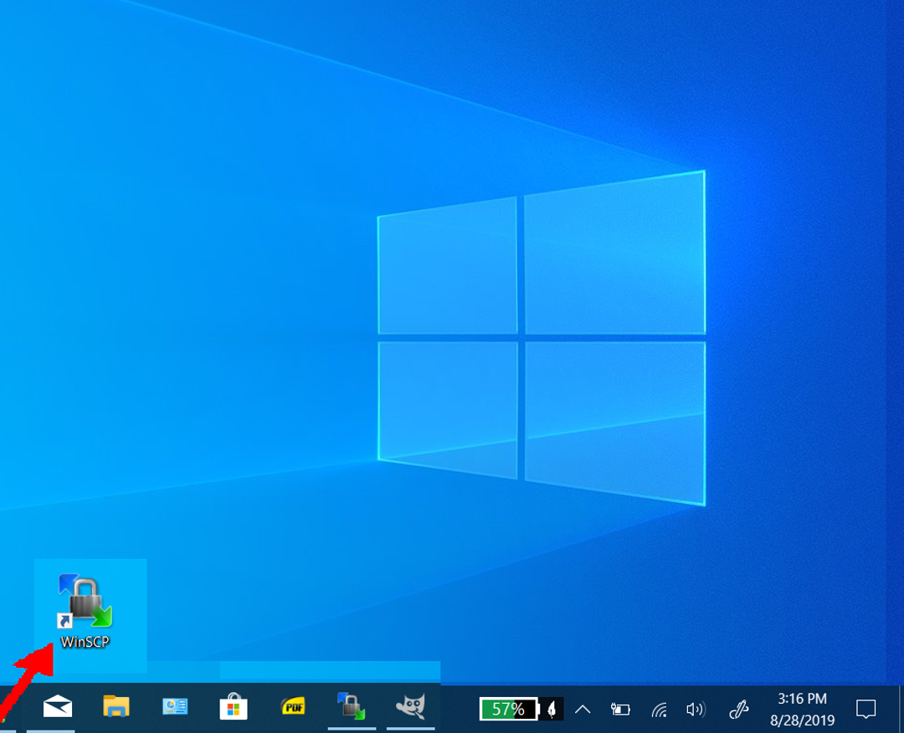
 
 
 
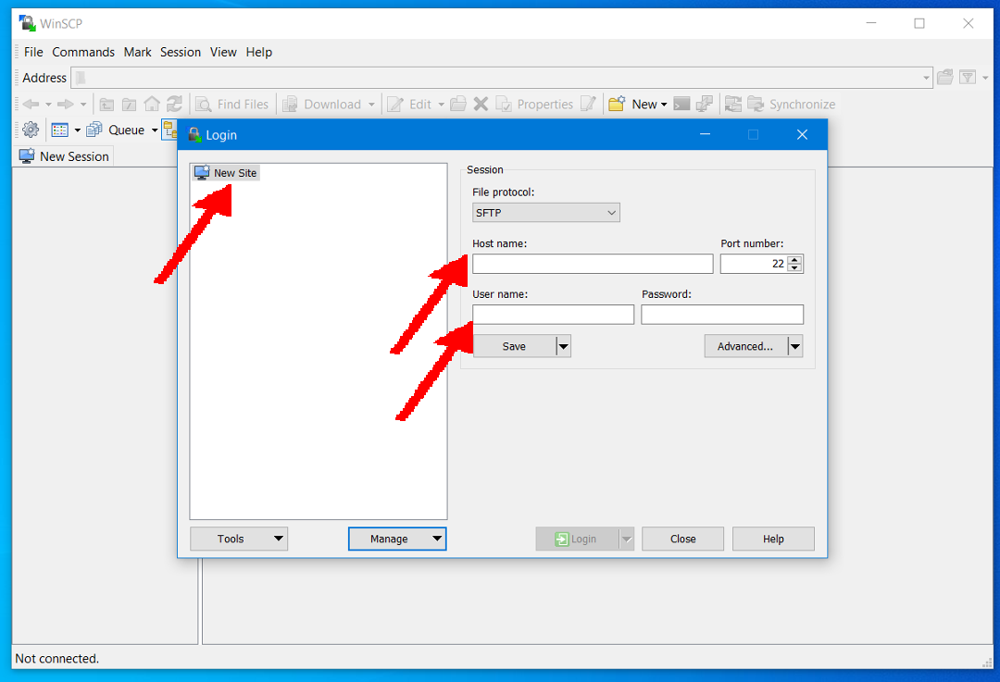
 
 
 
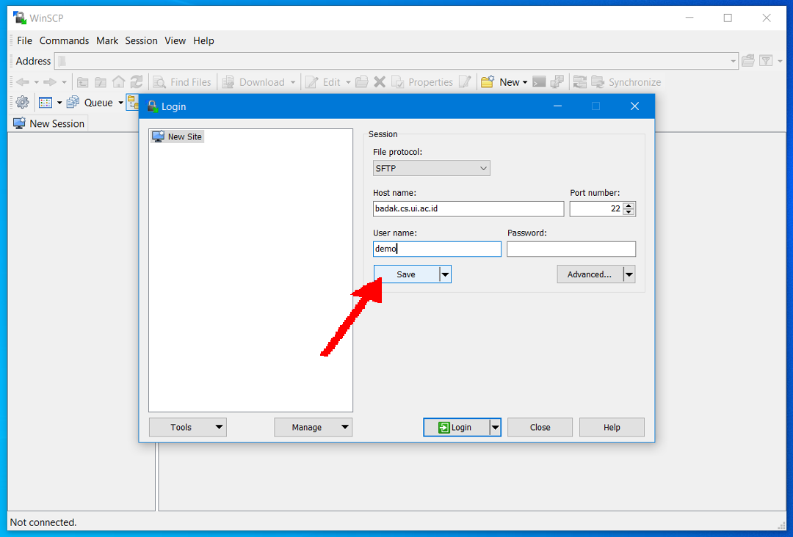
 
 
 
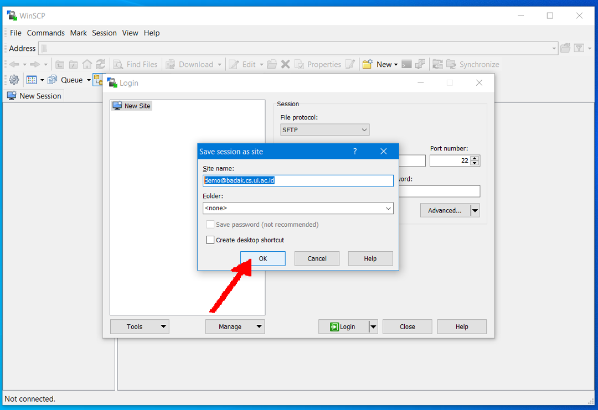
 
 
 
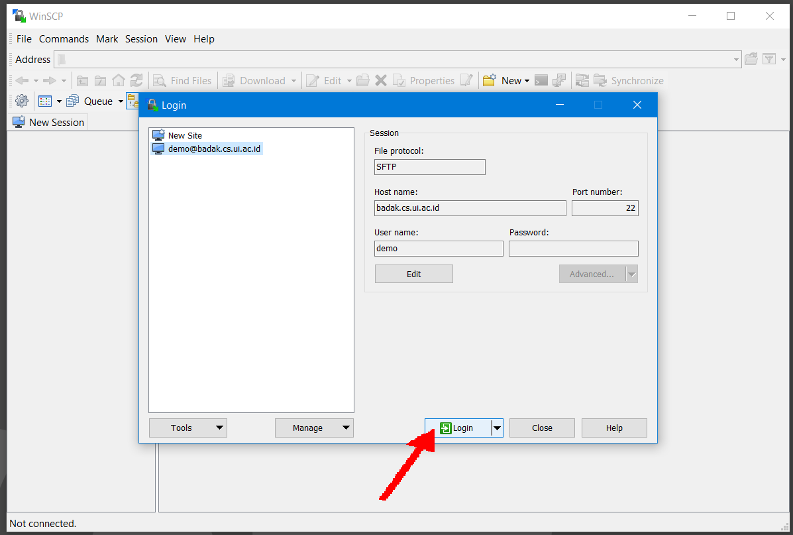
 
 
 
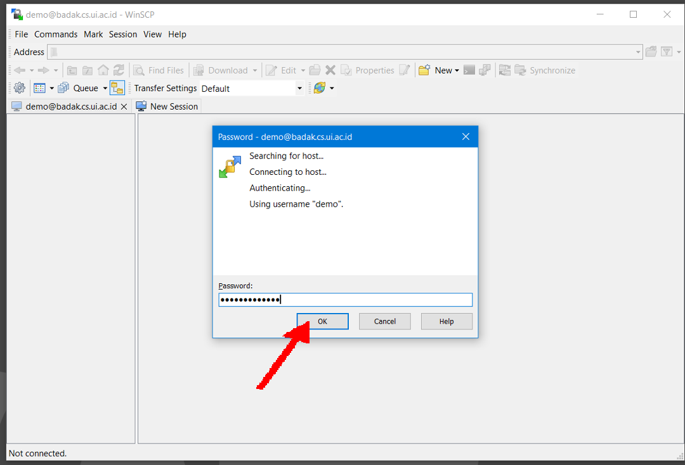
 
 
 
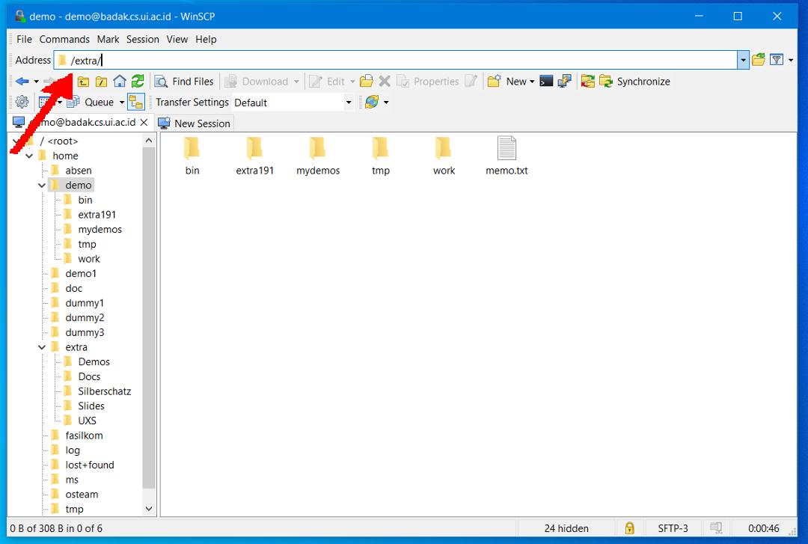
 
 
 
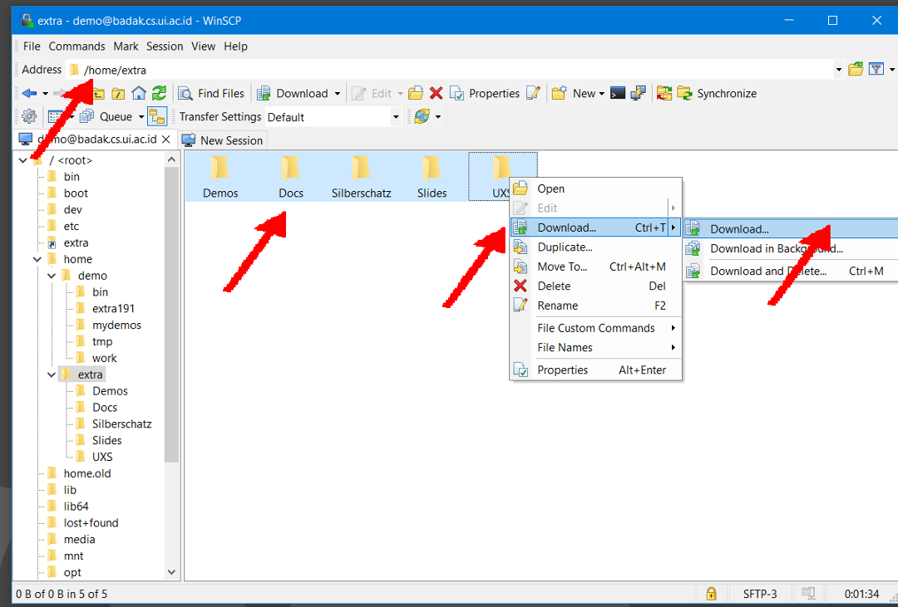
 
 
 
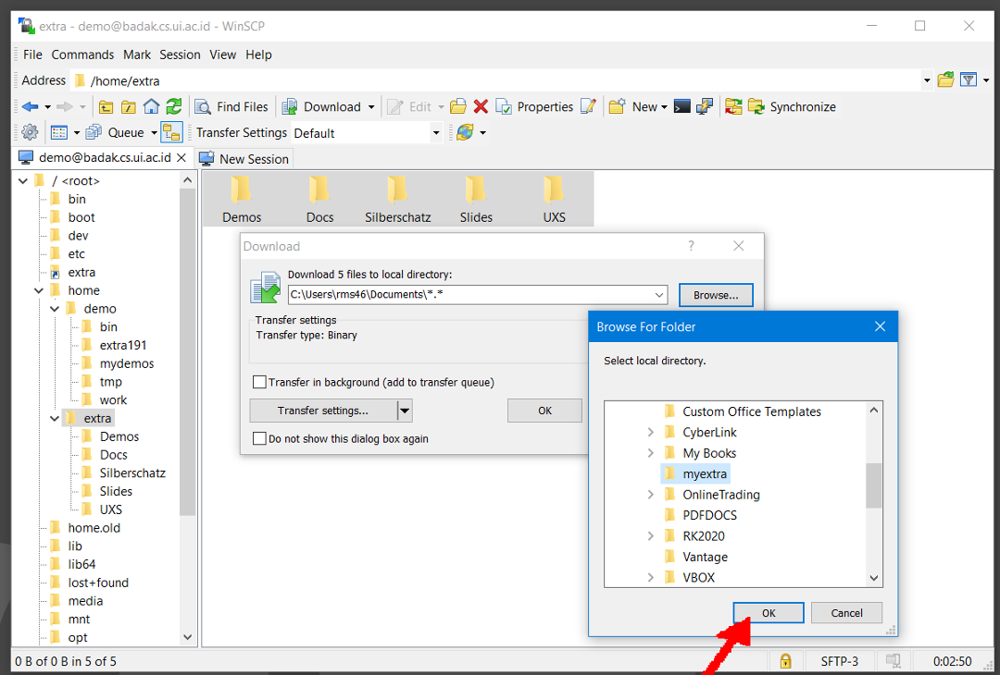
 
 
 
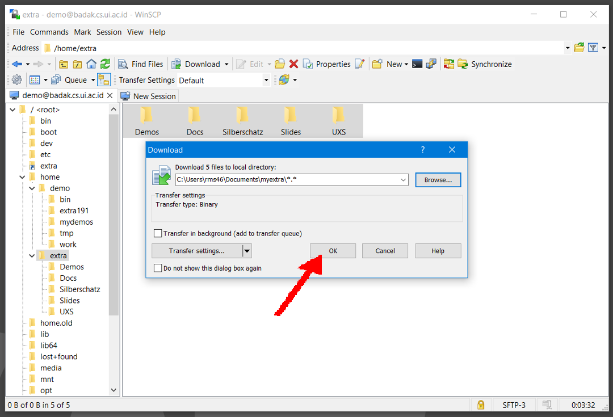
 
 
 
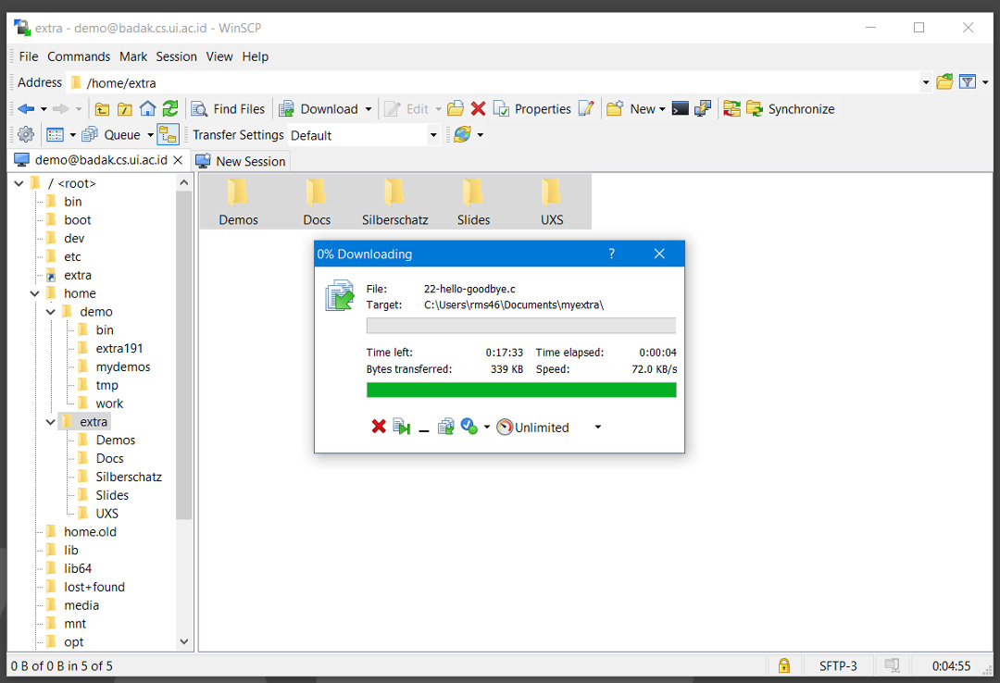
 
 
 

 
 
 
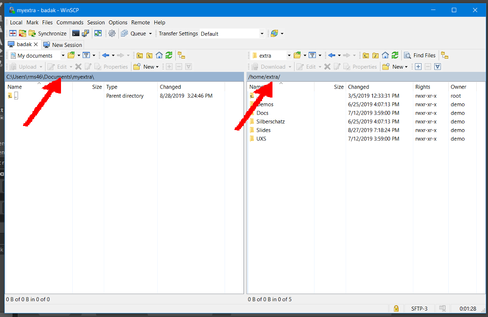
 
 
 
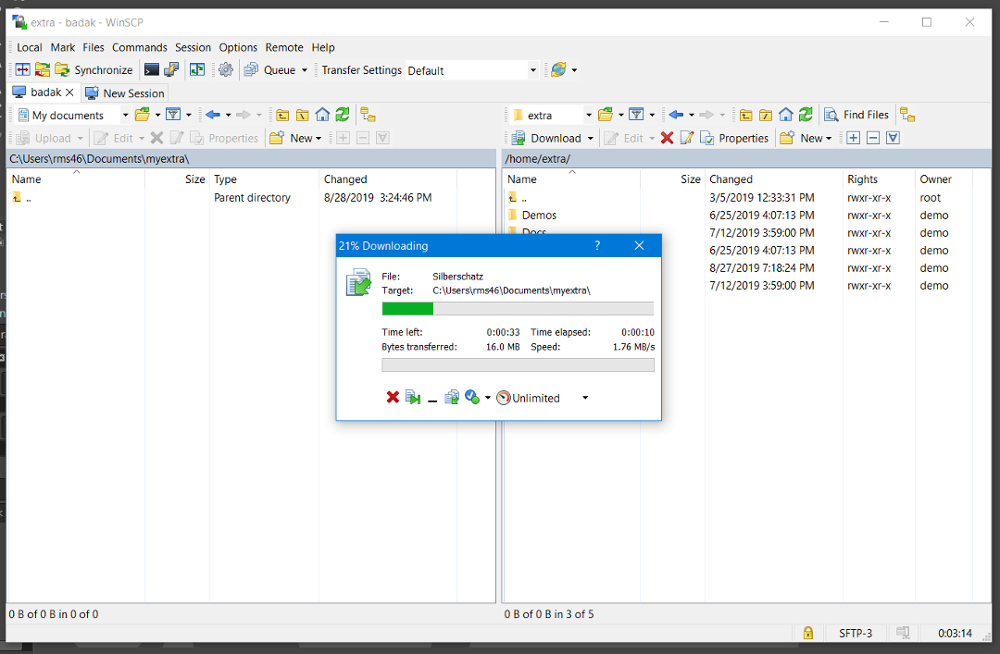
 
 
 
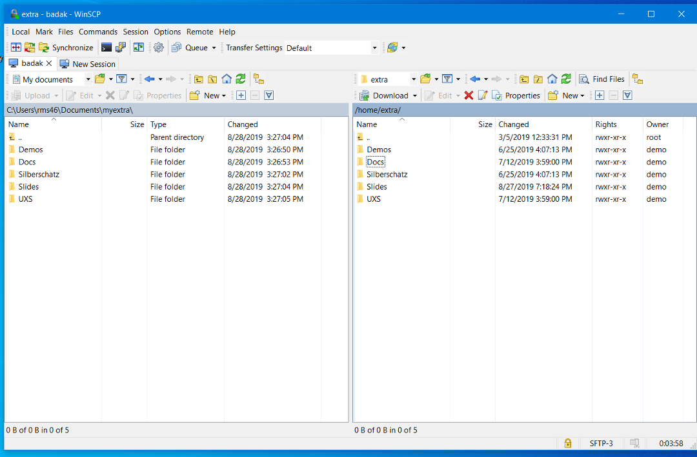
 
 
 
Tulisan ini terutama untuk <b>KEPERLUAN SENDIRI</b> ---berbasis 
"<i>Google Sana, Google Sini, Coba Itu, Coba Ini, Lalu Tanya-tanyi</i>".
Entah ini <b>PLAGIAT</b>, entah ini <b>RISET</b>, yang jelas tidak pernah ada klaim bahwa ini merupakan karya asli, 
dan belum tentu pula merupakan solusi terbaik :).
Mohon kiranya memberikan tanggapan, terutama jika memiliki solusi alternatif.
Semoga ini bermanfaat di masa mendatang, saat sudah lupa cara menyelesaikan masalah trivia ini.

<a href="http://rahmatm.samik-ibrahim.vlsm.org/">Rahmat M. Samik-Ibrahim</a>

